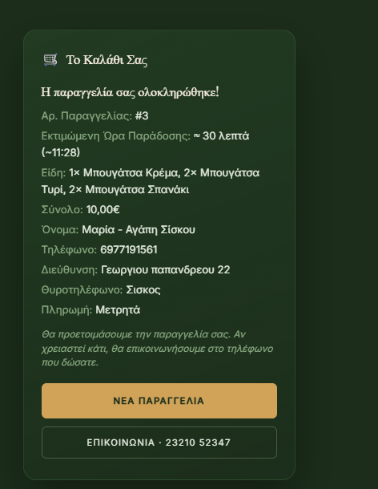
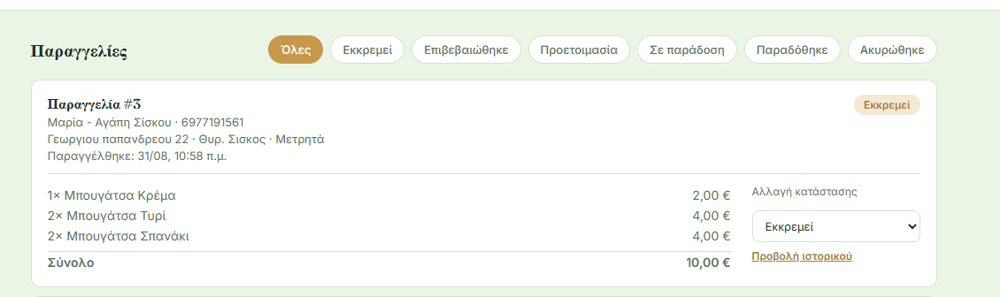

#  Bougatsa Zisis

### Website, Online Ordering & Administration Platform

A custom web platform designed and developed for our family business, **Bougatsa Zisis**, based in **Serres, Greece**.

This project was created around the real identity, products and operational needs of the business. It combines a modern public website, a **functional online ordering system** and a separate administration dashboard connected to a cloud PostgreSQL database.

---

## Project Overview

The platform consists of three connected parts:

- **Public website** for the business presentation, menu and store information
- **Online ordering system** with product selection, shopping cart and customer details
- **Administration dashboard** for managing orders, products and users

The customer-facing website and the administration dashboard work with the same centralized data source through **Supabase** and **PostgreSQL**.

---

## Public Website

The public website was built from scratch using **HTML5, CSS3 and JavaScript** and designed specifically around the visual identity of Bougatsa Zisis.

Main features include:

- Full-screen hero presentation
- Real business photography and custom branding
- Product and menu categories
- Company story / About section
- Store information
- Embedded Google Maps location
- Phone and directions actions
- Online ordering interface
- Responsive layouts for desktop and mobile
- Custom transitions and animations
- Reduced-motion accessibility support

The interface was custom-designed for the business and does not rely on a pre-built website template.

---

## Online Ordering System

Customers can browse the available product categories, select quantities and add products to a shopping cart.

The ordering workflow includes:

- Dynamic product loading from the database
- Category-based product browsing
- Quantity controls
- Shopping cart functionality
- Automatic order total calculation
- Customer name and phone number
- Delivery street and street number
- Optional intercom information
- Input validation
- Minimum-order validation
- Order confirmation
- Order ID returned after successful submission

Products are dynamically retrieved from the database through the `public_get_products` Supabase RPC function.

When an order is submitted, the website sends the selected products and customer information to the `public_create_order` database function.

### Payment

The interface includes both **cash** and **card** options.

At the current stage, online order submission is completed using **cash payment**. If card payment is selected, the customer is informed that online card payment is not yet available and can switch to cash or contact the store by phone.

---

## Ordering Workflow

### 1. Customer creates an order

The customer selects products, reviews the shopping cart, enters the required delivery information and submits the order.



### 2. The same order reaches the administration dashboard

After submission, the order is stored in the cloud database and becomes available to authorized staff through the administration dashboard.



This demonstrates the complete data flow between the customer-facing ordering interface and the internal administration system.

---

## Application Flow

```text
Customer
   │
   ▼
Public Website
   │
   ▼
Live Product Menu
   │
   ▼
Shopping Cart
   │
   ▼
Customer / Delivery Details
   │
   ▼
Order Submission
   │
   │ HTTPS + Fetch API
   ▼
Supabase API / PostgreSQL RPC
   │
   ▼
PostgreSQL Database
   │
   ▼
Administration Dashboard
   │
   ▼
Order Processing & Status History
```

---

## Administration Dashboard

A separate administration interface was developed for internal business use.

The dashboard includes a protected login system and provides different functionality depending on the user's role.

### Order Management

Authorized users can:

- View incoming orders
- View customer contact information
- View delivery information
- View ordered products and quantities
- View the total order value
- Filter orders by status
- Change the current order status
- View the status-change history of each order

Supported order states:

```text
Pending
   ↓
Confirmed
   ↓
Preparing
   ↓
Out for Delivery
   ↓
Delivered
```

Orders can also be marked as **Cancelled**.

---

## New Order Notifications

The administration dashboard periodically checks for new orders.

When a new order is detected, the system can:

- Play an audio notification using the **Web Audio API**
- Display a browser notification using the **Notifications API**
- Automatically refresh the order list

The first check after login establishes the current order baseline so that existing orders are not incorrectly treated as new.

---

## Product Management

The administration dashboard includes product management functionality.

Authorized users can:

- View products
- View product categories
- Modify product prices
- Enable or disable product availability
- Save changes directly to the database

The public ordering interface retrieves the updated product information from the same centralized backend.

---

## User Management

The administration system supports two user roles:

### Administrator

Administrators have access to the complete management interface, including user administration.

### Staff

Staff users have access to the operational functionality required for day-to-day order handling.

Administrator functionality includes:

- Create new users
- Assign user roles
- Activate or deactivate accounts
- Change user passwords
- View account status

---

## Authentication & Sessions

The administration dashboard uses a custom username/password authentication flow implemented through PostgreSQL RPC functions exposed by Supabase.

After a successful login:

1. The database returns a session token.
2. The token is stored in the browser's `localStorage`.
3. Protected administration RPC calls include the session token.
4. Database-side functions validate the session before returning or modifying protected data.
5. The application attempts to restore an existing valid session when the administration page is reopened.
6. Logout invalidates the active session and removes the locally stored token.

Administrator-only functionality is also separated from Staff functionality according to the authenticated user's role.

---

## Database & Backend Architecture

The project uses **Supabase** as its cloud backend platform and **PostgreSQL** as the relational database.

Rather than maintaining a separate traditional application server, the frontend communicates with database-side functionality through Supabase's REST/RPC interface.

### Public RPC Functions

- `public_get_products`
- `public_create_order`

### Administration RPC Functions

- `auth_login`
- `auth_logout`
- `auth_whoami`
- `admin_get_orders`
- `admin_update_order_status`
- `admin_get_order_history`
- `admin_get_products`
- `admin_update_product`
- `admin_get_users`
- `admin_create_user`
- `admin_update_user`

This architecture provides a centralized persistent data source shared by both the customer-facing ordering system and the administration dashboard.

---

## API Communication

Browser-to-backend communication is implemented using the JavaScript **Fetch API** over HTTPS.

```text
HTML / CSS / JavaScript
          │
          │ Fetch API
          ▼
     Supabase REST API
          │
          ▼
    PostgreSQL RPC
          │
          ▼
   PostgreSQL Database
```

Request and response payloads are exchanged using **JSON**.

---

## Technologies Used

| Area | Technology |
|---|---|
| Structure | HTML5 |
| Styling | CSS3 |
| Frontend Logic | JavaScript |
| API Communication | Fetch API |
| Backend Platform | Supabase |
| Database | PostgreSQL |
| Server-side Logic | PostgreSQL RPC Functions |
| Data Exchange | JSON |
| Authentication | Custom token-based sessions |
| Session Storage | Web Storage / `localStorage` |
| Browser Notifications | Notifications API |
| Audio Notifications | Web Audio API |
| Maps | Google Maps Embed / Directions |
| Typography | Google Fonts |
| Version Control | Git |
| Source Code Hosting | GitHub |

---

## UI / UX

The customer-facing website and administration dashboard use different visual approaches because they serve different purposes.

### Customer Website

The public interface focuses on the identity and presentation of the family business through:

- Custom green, cream and gold visual palette
- Playfair Display and Inter typography
- Full-screen photographic hero
- Real business photography
- Smooth transitions
- Animated content reveals
- Sticky navigation
- Responsive product layouts
- Responsive ordering interface
- Mobile-specific breakpoints
- Sticky shopping-cart interaction

### Administration Dashboard

The administration interface prioritizes operational clarity and efficient order management through:

- Protected login screen
- Sticky navigation
- Order status filters
- Status badges
- Order cards
- Product management tables
- User management tables
- Modal dialogs
- Responsive layouts for smaller screens

---

## Responsive Design

Responsive CSS is used throughout the project to adapt the platform to different screen sizes.

Examples include:

- Hero layout changing from two columns to one
- Store section adapting to a single-column layout
- Ordering interface changing from a cart sidebar to a stacked mobile layout
- Product rows adapting to smaller screens
- Administration order cards stacking vertically on mobile devices

The project also respects `prefers-reduced-motion` for users who prefer reduced animation.

---

## Store Integration

The public website includes real store information and Google Maps integration.

Customers can:

- View the store location through an embedded map
- Open Google Maps directions
- Call the store directly
- View operating hours

This connects the digital platform with the physical family business.

---

## Publication & Deployment

The project separates **source-code publication**, **backend hosting** and **frontend deployment**.

### Source Code

The project source code is version-controlled using **Git** and published on **GitHub** for:

- Source-code hosting
- Version history
- Project documentation
- Portfolio presentation
- Future development and maintenance

### Backend

The backend infrastructure is hosted on **Supabase**, which provides:

- PostgreSQL database hosting
- Database RPC functions
- Persistent application data
- REST API access

### Frontend Deployment

The public website and administration dashboard are currently developed as browser-based HTML, CSS and JavaScript applications.

**Public frontend deployment has not yet been completed.**

The frontend can be deployed using a static web-hosting solution while continuing to communicate with the existing Supabase backend.

A public **Live Demo** link can be added after frontend deployment is completed.

---

## Architecture

```text
                 BOUGATSA ZISIS PLATFORM

        ┌──────────────────────────────┐
        │           Customer           │
        └──────────────┬───────────────┘
                       │
                       ▼
        ┌──────────────────────────────┐
        │        Public Website        │
        │      + Online Ordering       │
        └──────────────┬───────────────┘
                       │
                  HTTPS / Fetch
                       │
                       ▼
        ┌──────────────────────────────┐
        │           Supabase           │
        │       REST API / RPC         │
        └──────────────┬───────────────┘
                       │
                       ▼
        ┌──────────────────────────────┐
        │          PostgreSQL          │
        │           Database           │
        └──────────────┬───────────────┘
                       │
                  HTTPS / Fetch
                       │
                       ▼
        ┌──────────────────────────────┐
        │    Administration Dashboard  │
        │ Orders · Products · Users    │
        └──────────────────────────────┘
```

---

## Repository Structure

```text
mpougatsa-zisis-site/
│
├── index.html
├── admin.html
├── styles.css
├── hero-display-case.jpg
├── logo-emblem.png
├── logo-emblem-dark.png
├── site_order.png
├── admin_order.png
└── README.md
```

---

## Why This Project Was Built

**Bougatsa Zisis is our family business**, so this project was developed for a real business use case rather than as a fictional development exercise.

The objective was not simply to create a business website, but to connect the company's public digital presence with a functional ordering and administration workflow.

The project brings together:

- Custom UI/UX design
- Responsive frontend development
- Dynamic product data
- Shopping-cart logic
- Customer order submission
- Relational database usage
- Cloud backend integration
- API communication
- Authentication and session handling
- Role-based administration
- Product management
- Order status tracking
- Order history
- Browser and audio notifications
- Google Maps integration
- Git version control
- GitHub source-code publication

It demonstrates the development of a small full-stack business platform using browser technologies and a cloud PostgreSQL backend.

---

## Current Limitations / Future Improvements

Future improvements may include:

- Online card-payment integration
- Real-time order updates instead of periodic polling
- Customer-facing live order tracking
- Delivery-zone validation
- Analytics and reporting
- Automated deployment pipeline
- Additional administration audit functionality
- Public frontend deployment and Live Demo

---

## Bougatsa Zisis

**Serres, Greece**

Custom designed and developed for our family business.